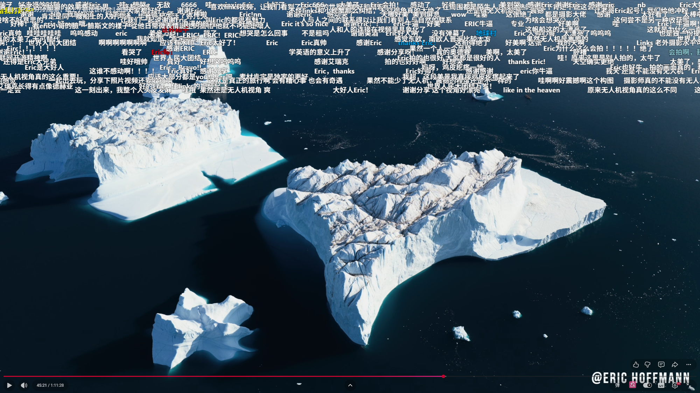
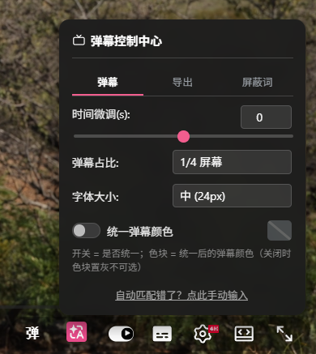
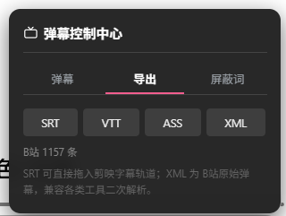
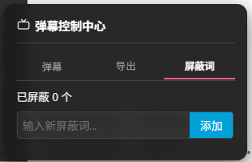

# AutoB2Y

[中文](#中文) | [English](#english) | [📋 更新日志 / Changelog](CHANGELOG.md)

---

<h2 id="中文">📺 AutoB2Y (YouTube ✖️ Bilibili 弹幕同步引擎)</h2>

AutoB2Y 是一款轻量级的纯前端浏览器扩展，旨在将 Bilibili (B站) 的弹幕无缝同步至 YouTube 的原生播放器中。无论是搬运视频还是官方授权发布的跨平台视频，都能找回熟悉的观看体验。

### ✨ 核心特性
- **原生融合 UI**：控制按钮嵌入 YouTube 播放器右下角控制栏，点击即在控制栏上方展开面板，不遮挡画面；面板采用「弹幕 / 导出 / 屏蔽词」三标签二级窗口布局，一屏不再杂乱。
- **Canvas 高性能渲染**：防碰撞引擎、支持字体无极缩放、自定义颜色、动态抗锯齿文字描边。
- **无极滑块调节**：支持弹幕时间轴微调 (Offset 精度 0.5s)、高度占比调节、字号大小的无极拖拽。
- **统一弹幕颜色**：胶囊开关一键把全部弹幕改成同一颜色；开关与色块联动——关闭时色块置灰禁用、开启后点色块即选色，行内提示明确标出两者关系。
- **区域实时预览**：拖动「弹幕占比」滑块时，播放器上实时叠加一条半透明粉色色带与百分比标签（B站弹幕区），松手 1.2 秒后自动淡出。
- **本地屏蔽词管理**：面板内置屏蔽词管理，可随时增删；规则只保存在你自己的浏览器里，不上传、不同步。
- **ResizeObserver 物理级自适应**：无论网页缩放、全屏还是切换到剧场模式，弹幕画面都能基于真实 DOM 尺寸重绘，永不穿帮拉伸。
- **双向互搜**：YouTube 视频一键去 B站 找弹幕，B站 视频一键去 YouTube 找高清 4K 原片。
- **B站直达 YouTube 原片**：优先反查 B2Y 开源项目的「YouTube 频道 ↔ B站UP」关联库，在该频道内按标题+时长智能选片，直接打开具体视频；查不到时自动解析全站搜索结果选片，最后才退回搜索页。
- **网络容错重试**：B站搜索 / 分P / 弹幕接口全部带超时 + 指数退避重试，风控 (-412)、网络抖动不再直接失败。
- **弹幕导出字幕**：B站页与 YouTube 页均可一键把弹幕导出为 **SRT / VTT / ASS / XML**，剪映、PR、达芬奇可直接导入（ASS 保留弹幕原色）。
- **失败一键重试与状态自愈**：B站弹幕匹配失败点「重新自动匹配」（旁边仍可手动填 BV 矫正）；B站 跳 YouTube 失败按钮变「点击重试」；导出失败提示可再次点击导出——所有失败态都有再试入口，且与手动路径互不冲突。匹配请求 12 秒无响应自动接管重发、页面卡在「等待中」超过 18 秒自动重启匹配（最多 3 次），过期响应直接丢弃；状态徽章只在查找/出错时显示，匹配成功即自动隐藏，不再常驻标题栏。
- **SPA 路由免刷新**：监听 YouTube / B站 前端路由事件，切换视频后自动重新匹配、自动重建弹幕层，无需手动刷新页面。
- **面板自动退出**：鼠标离开面板 4 秒后自动收起；播放器控制条自动隐藏时面板同步关闭，鼠标悬停在面板上时不会误关。
- **Serverless (零服务器)**：完全利用扩展程序的跨域权限直连 B站 API。无任何第三方服务器，保护隐私且拒绝停服断连。

| 控制面板主视图 | 弹幕导出 | 屏蔽词管理 |
| :---: | :---: | :---: |
|  |  |  |

### 📦 安装方法
1. 下载本仓库的 `Source code (zip)` 或 Release 中的最新压缩包，并解压为一个文件夹。
2. 打开浏览器的扩展管理页面：Chrome / Brave 用 `chrome://extensions/`，Edge 用 `edge://extensions/`。
3. 开启页面右上角的 **开发者模式 (Developer mode)**。
4. 点击 **加载已解压的扩展程序 (Load unpacked)**，选择刚刚解压的文件夹即可。

### 🛠️ 使用说明
- **全自动挂载**：播放 YouTube 视频时，扩展会自动利用视频标题与视频总时长去 B站 检索，匹配成功后自动拉取弹幕。
- **手动矫正补救**：如果视频由于 B站 改名导致自动匹配失败，或者时间轴错位严重，面板「弹幕」标签会亮起救援框：可先点「重新自动匹配」再试一次，也可直接粘贴 B站 的 `BV号` 强制挂载（多P 用 `BV1xxx?p=2`），两条路互不影响。
- **导出字幕**：切到面板「导出」标签选 SRT / VTT / ASS / XML；B站 视频页标题旁点「导出字幕」即可，SRT 可直接导入剪映。
- **调节预览**：拖动「弹幕占比」滑块时，播放器上会实时显示该区域的位置与百分比。
- **B站 → YouTube**：视频页标题旁点「YouTube」，会先按关联库定向到该 UP 的 YouTube 频道选片，直接打开具体视频；定位失败按钮会变「点击重试」。

---

<h2 id="english">📺 AutoB2Y (YouTube ✖️ Bilibili)</h2>

AutoB2Y is a lightweight, frontend-only browser extension designed to seamlessly synchronize Bilibili (B-Station) Danmaku (scrolling comments) onto YouTube's native video player.

### ✨ Features
- **Native UI Integration**: The control button sits in YouTube's bottom-right control bar; the panel opens just above it. It uses a three-tab layout (Danmaku / Export / Blocklist) so each secondary window only shows what you need.
- **High-Performance Canvas Rendering**: Built-in anti-overlap logic, font scaling, custom colors, and dynamic text strokes for visibility.
- **Slider Adjustments**: Infinitely variable slider adjustments for time offset, screen coverage percentage, and font size.
- **Unified Danmaku Color**: A capsule toggle restyles every comment with one color; the toggle and color swatch are linked — the swatch greys out while the toggle is off, and clicking it picks a color while on.
- **Live Region Preview**: While dragging the coverage slider, a translucent pink band with a percentage label is overlaid on the player (danmaku zone) and fades out after 1.2s.
- **Local Blocklist**: A built-in blocklist manager — add or remove words at any time. Rules stay in your browser only; nothing is uploaded or synced.
- **ResizeObserver Auto-Adaptation**: Bulletproof responsiveness across window resizing, full-screen, and theater mode transitions. No more stretched or detached comments.
- **Bi-directional Search**: One-click jump from YouTube to Bilibili for Danmaku, and from Bilibili to YouTube for high-res source videos.
- **Bilibili → YouTube Direct Link**: Resolves the exact YouTube video by looking up the B2Y open-source channel association DB (YouTube channel ↔ Bilibili UP), then matches title + duration inside that channel; falls back to smart full-site search parsing, then to the plain search page.
- **Network Retry**: All Bilibili APIs are wrapped with timeout + exponential backoff retries, so brief network hiccups or risk-control responses no longer break the flow.
- **Danmaku Subtitle Export**: Export danmaku as **SRT / VTT / ASS / XML** on both the Bilibili page and the YouTube panel — import directly into JianYing / Premiere / DaVinci (ASS keeps original colors).
- **One-click Retry & Self-healing**: "重新自动匹配" for danmaku matching (manual BV input stays alongside), the jump button turns into "点击重试" on failure, and export failures hint you to click again — every failure state has a retry entry that never conflicts with manual paths. A match request with no response for 12s is automatically re-sent, a page stuck in "waiting" for 18s restarts matching (up to 3 times), and stale responses are dropped; the status badge only shows while searching or on error, then hides itself once matched.
- **SPA-safe Reloading**: Listens to YouTube / Bilibili front-end route events and rebuilds the danmaku layer automatically — no more manual refresh after switching videos.
- **Auto-dismiss Panel**: The panel collapses 4 seconds after your mouse leaves it, and closes together with the player's auto-hiding control bar (hovering over the panel keeps it open).
- **Serverless Architecture**: Connects directly to Bilibili APIs using extension cross-origin permissions. No third-party proxy servers involved, ensuring privacy and permanent availability.
- **Completely Free**: No purchases, no subscriptions, no ads — every feature is free, with no account registration required.

### 📦 Installation
1. Download the `Source code (zip)` from this repository or the latest Release and extract it to a folder.
2. Open the Extensions management page: `chrome://extensions/` in Chrome / Brave, or `edge://extensions/` in Edge.
3. Toggle on **Developer mode** in the top right corner.
4. Click **Load unpacked** and select the extracted folder.

### 🛠️ Usage
- **Auto-Sync**: When playing a YouTube video, the extension will automatically search Bilibili using the video title and exact duration to fetch matching Danmaku.
- **Manual Rescue**: If auto-matching fails, the Danmaku tab shows a rescue box — click "重新自动匹配" to try again, or paste the Bilibili `BV ID` to force-load (`?p=2` for multi-page videos). The two paths are independent.
- **Subtitle Export**: Pick SRT / VTT / ASS / XML in the Export tab of the panel, or use the "导出字幕" button next to the title on Bilibili. SRT imports straight into JianYing / Premiere.
- **Live Region Preview**: Drag the coverage slider to see the danmaku zone overlaid on the player with its percentage.
- **Bilibili → YouTube**: Click "YouTube" next to the video title; it resolves the exact video via the channel association DB first, with smart search as fallback — on failure the button turns into "点击重试".

### 📄 License
MIT License

### 📦 Third-party components

- **[danmaku](https://github.com/weizhenye/Danmaku)** v2.0.10 — MIT License, © Zhenye Wei.
  Bundled as `danmaku.min.js`. Upstream build ships without a license banner, so the copyright
  notice and permission notice are reproduced here as required by the MIT License.
  **Local modification**: one line added to the canvas renderer to support an optional
  `style.backgroundColor` block behind an individual comment. All other code is unmodified.
- **[B2Y (bilibili-youtube-danmaku)](https://github.com/ahaduoduoduo/bilibili-youtube-danmaku)** — MIT License, © ahaduoduoduo.
  A snapshot of its `channel-associations.json` (YouTube channel ↔ Bilibili UP mapping) is bundled as a
  fallback for the Bilibili → YouTube direct-jump feature; the extension also tries to fetch the latest
  copy from the upstream repository (cached for 7 days).
