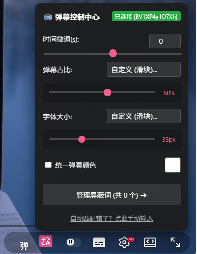
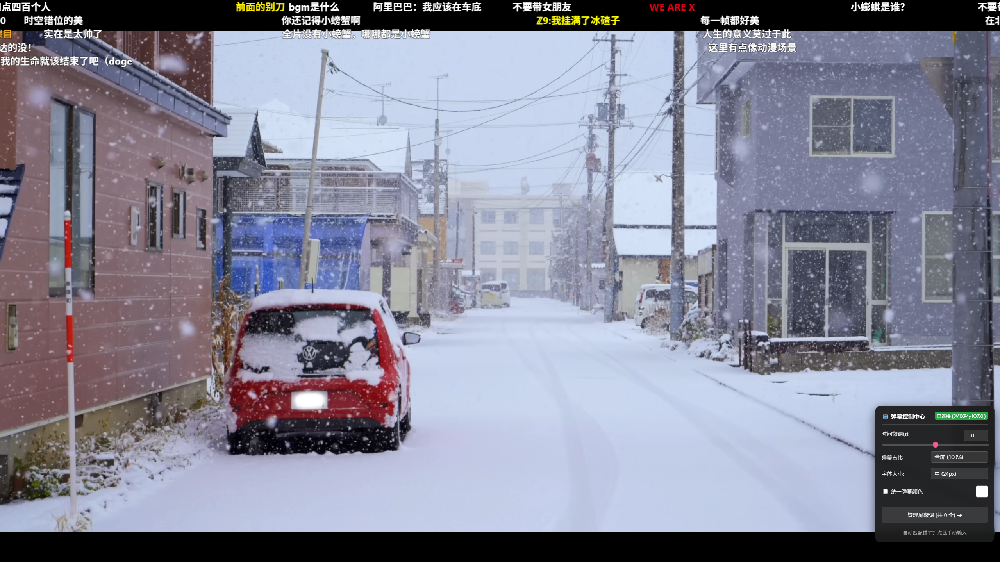

# AutoB2Y

[中文](#中文) | [English](#english)

---

<h2 id="中文">📺 AutoB2Y (YouTube ✖️ Bilibili 弹幕同步引擎)</h2>

AutoB2Y 是一款轻量级的纯前端浏览器扩展，旨在将 Bilibili (B站) 的弹幕无缝同步至 YouTube 的原生播放器中。无论是搬运视频还是官方授权发布的跨平台视频，都能找回熟悉的观看体验。

### ✨ 核心特性
- **原生融合 UI**：控制按钮嵌入 YouTube 播放器右下角控制栏，点击即在控制栏上方展开面板，不遮挡画面。
- **Canvas 高性能渲染**：防碰撞引擎、支持字体无极缩放、自定义颜色、动态抗锯齿文字描边。
- **无极滑块调节**：支持弹幕时间轴微调 (Offset 精度 0.5s)、高度占比调节、字号大小的无极拖拽。
- **本地屏蔽词管理**：面板内置屏蔽词管理，可随时增删；规则只保存在你自己的浏览器里，不上传、不同步。
- **ResizeObserver 物理级自适应**：无论网页缩放、全屏还是切换到剧场模式，弹幕画面都能基于真实 DOM 尺寸重绘，永不穿帮拉伸。
- **双向互搜**：YouTube 视频一键去 B站 找弹幕，B站 视频一键去 YouTube 找高清 4K 原片。
- **Serverless (零服务器)**：完全利用扩展程序的跨域权限直连 B站 API。无任何第三方服务器，保护隐私且拒绝停服断连。

| 控制面板主视图 | 无极滑块展开（自定义占比与字号） |
| :---: | :---: |
|  |  |

### 📦 安装方法
1. 下载本仓库的 `Source code (zip)` 或 Release 中的最新压缩包，并解压为一个文件夹。
2. 打开浏览器的扩展管理页面：Chrome / Brave 用 `chrome://extensions/`，Edge 用 `edge://extensions/`。
3. 开启页面右上角的 **开发者模式 (Developer mode)**。
4. 点击 **加载已解压的扩展程序 (Load unpacked)**，选择刚刚解压的文件夹即可。

### 🛠️ 使用说明
- **全自动挂载**：播放 YouTube 视频时，扩展会自动利用视频标题与视频总时长去 B站 检索，匹配成功后自动拉取弹幕。
- **手动矫正补救**：如果视频由于 B站 改名导致自动匹配失败，或者时间轴错位严重，面板顶部会亮起警告并弹出输入框。直接粘贴 B站 的 `BV号` 即可强制挂载！

---

<h2 id="english">📺 AutoB2Y (YouTube ✖️ Bilibili)</h2>

AutoB2Y is a lightweight, frontend-only browser extension designed to seamlessly synchronize Bilibili (B-Station) Danmaku (scrolling comments) onto YouTube's native video player.

### ✨ Features
- **Native UI Integration**: The control button sits in YouTube's bottom-right control bar; the panel opens just above it without covering the picture.
- **High-Performance Canvas Rendering**: Built-in anti-overlap logic, font scaling, custom colors, and dynamic text strokes for visibility.
- **Slider Adjustments**: Infinitely variable slider adjustments for time offset, screen coverage percentage, and font size.
- **Local Blocklist**: A built-in blocklist manager — add or remove words at any time. Rules stay in your browser only; nothing is uploaded or synced.
- **ResizeObserver Auto-Adaptation**: Bulletproof responsiveness across window resizing, full-screen, and theater mode transitions. No more stretched or detached comments.
- **Bi-directional Search**: One-click jump from YouTube to Bilibili for Danmaku, and from Bilibili to YouTube for high-res source videos.
- **Serverless Architecture**: Connects directly to Bilibili APIs using extension cross-origin permissions. No third-party proxy servers involved, ensuring privacy and permanent availability.
- **Completely Free**: No purchases, no subscriptions, no ads — every feature is free, with no account registration required.

### 📦 Installation
1. Download the `Source code (zip)` from this repository or the latest Release and extract it to a folder.
2. Open the Extensions management page: `chrome://extensions/` in Chrome / Brave, or `edge://extensions/` in Edge.
3. Toggle on **Developer mode** in the top right corner.
4. Click **Load unpacked** and select the extracted folder.

### 🛠️ Usage
- **Auto-Sync**: When playing a YouTube video, the extension will automatically search Bilibili using the video title and exact duration to fetch matching Danmaku.
- **Manual Rescue**: If auto-matching fails due to title discrepancies, a warning and an input field will appear. Simply paste the Bilibili `BV ID` to force-load the specific video's comments!

### 📄 License
MIT License

### 📦 Third-party components

- **[danmaku](https://github.com/weizhenye/Danmaku)** v2.0.10 — MIT License, © Zhenye Wei.
  Bundled as `danmaku.min.js`, unmodified from the upstream release
  (byte-for-byte identical except for a trailing newline). The minified upstream build ships
  without a license banner, so the copyright notice and permission notice are reproduced here
  as required by the MIT License.
